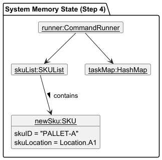
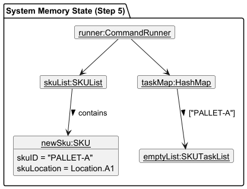
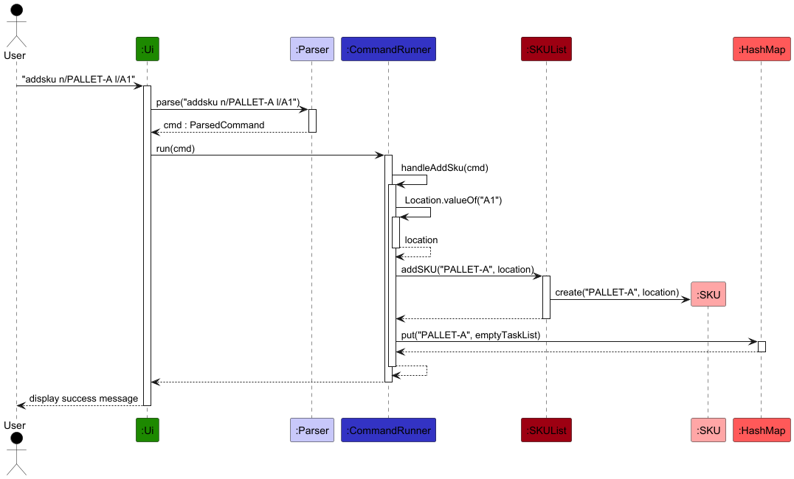
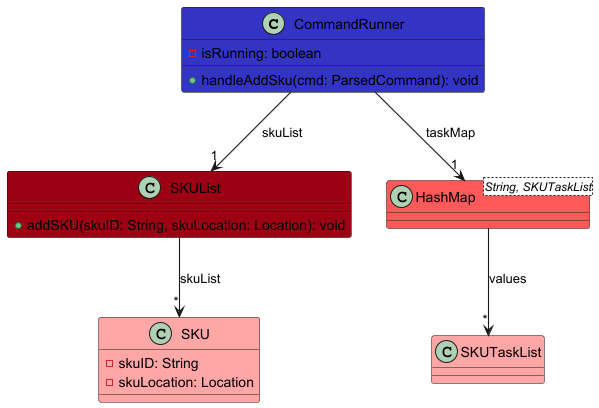

# Developer Guide

## Acknowledgements

{list here sources of all reused/adapted ideas, code, documentation, and third-party libraries -- include links to the original source as well}

## Design

## Implementation

### Add / Delete SKU Feature

#### Implementation Details
The Add and Delete SKU mechanism is facilitated by the `CommandRunner` component, which manages the application's core state across two primary data structures: the `SKUList` and a `HashMap<String, SKUTaskList>` named `taskMap`.

The operations are exposed and handled internally via the following methods:
* `CommandRunner#handleAddSku(ParsedCommand)` — Validates constraints, instantiates a new `SKU`, and initializes its task mapping.
* `CommandRunner#handleDeleteSku(ParsedCommand)` — Removes the `SKU` from the inventory and purges its associated task list from the map.

Given below is an example usage scenario demonstrating how the Add SKU mechanism behaves at each step.

**Step 1.** The user executes `addsku n/PALLET-A l/A1`. The `Ui` reads the input, and the `Parser` extracts the command word and maps the arguments `n/` to `PALLET-A` and `l/` to `A1` into a `ParsedCommand` object.

**Step 2.** The `CommandRunner#run()` method receives this `ParsedCommand`. Recognizing the `addsku` command word, it routes execution to `CommandRunner#handleAddSku()`.

**Step 3.** `handleAddSku()` parses the location string into a `Location` enum. It then calls `findSku("PALLET-A")` to iterate through the `SKUList`. Finding no duplicates, it proceeds with the insertion.

**Step 4.** The `SKUList#addSKU()` method is invoked. This method calls the `SKU` constructor, instantiating a new `SKU` object, and appends it to its internal `ArrayList`.

**Step 5.** Back in `handleAddSku()`, the `CommandRunner` explicitly instantiates a new, empty `SKUTaskList` and inserts it into the `taskMap`, using the uppercase SKU ID (`"PALLET-A"`) as the key. The UI then prints the success message.

*Note: The `deletesku` command operates in the exact reverse, calling `SKUList#deleteSKU()` to remove the object from the array and `taskMap.remove()` to purge the associated task list.*

The following sequence diagram shows the flow of adding a SKU:

The following sequence diagram shows the architecture:

#### Design considerations:

**Aspect: How SKU tasks are stored and mapped to their parent SKU:**
* **Alternative 1 (Current Implementation):** The system maintains a global `HashMap<String, SKUTaskList>` inside the `CommandRunner` to map SKU IDs to their tasks.
    * *Pros:* Fast, O(1) time complexity when looking up tasks for a specific SKU during filtering or task addition.
    * *Cons:* Severe data duplication and poor encapsulation. The `SKU` class already initializes its own internal `SKUTaskList` in its constructor, which the `CommandRunner` effectively ignores by managing a redundant, external map. This requires the `CommandRunner` to remember to synchronize deletions across two separate data structures.
* **Alternative 2 (Slower lookup time):** Remove the `HashMap` from `CommandRunner` entirely. Force all task operations to access the `SKUTaskList` directly through the `SKU` object (e.g., `skuList.getSku("PALLET-A").getTaskList().addTask(...)`).
    * *Pros:* A SKU is solely responsible for its own tasks. Memory overhead is reduced by removing the redundant map.
    * *Cons:* Slightly slower lookup times, as finding a task requires iterating through the `SKUList` to find the parent SKU first (O(n) complexity).

## Appendix A: Product Scope

### Target user profile

{Describe the target user profile}

### Value proposition

{Describe the value proposition: what problem does it solve?}

## Appendix B: User Stories

|Version| As a ... | I want to ... | So that I can ...|
|--------|----------|---------------|------------------|
|v1.0|new user|see usage instructions|refer to them when I forget how to use the application|
|v2.0|user|find a to-do item by name|locate a to-do without having to go through the entire list|

## Appendix C: Non-Functional Requirements

{Give non-functional requirements}

## Appendix D: Glossary

* *glossary item* - Definition

## Appendix E: Instructions for Manual Testing

{Give instructions on how to do a manual product testing e.g., how to load sample data to be used for testing}
