# Developer Guide

## Acknowledgements

This project used the [SE-EDU initiative's](https://se-education.org) AddressBook-Level3 (AB3) as guidance. We have customized its foundational architecture, parser logic, and command execution flow for our specific use case.

We also acknowledge the following for their contributions to our development process:
- [PlantUML](https://plantuml.com) for UML diagram generation.
- The NUS CS2113 teaching team for their instructional guidance and code templates.

## Design

### Architecture

ItemTasker follows a layered architecture with clear separation of concerns:

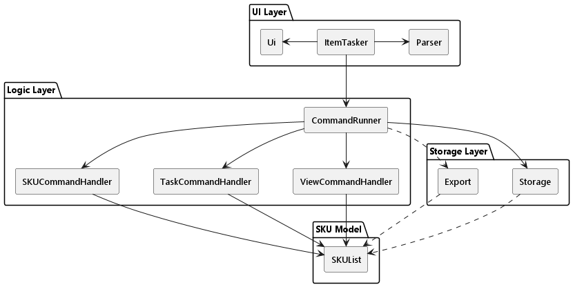

**Component Relationships:**

The diagram shows the main components and their relationships:

- **Ui** handles all user interface interactions
- **Parser** transforms raw input into structured `ParsedCommand` objects
- **CommandRunner** dispatches commands to the appropriate handler
- **SKUCommandHandler** manages SKU-level commands (`addsku`, `editsku`, `deletesku`)
- **TaskCommandHandler** manages task-level commands (`addskutask`, `edittask`, `deletetask`, `marktask`, `unmarktask`, `sorttasks`)
- **ViewCommandHandler** manages read-only commands (`listtasks`, `find`, `status`)
- **CommandHelper** and **DateValidator** provide shared validation utilities
- **TaskSorter** sorts tasks by date, priority, or completion status
- **SKUList** contains multiple **SKU** instances (1-to-many relationship)
- **SKU** contains one **SKUTaskList** which holds multiple **SKUTask** instances (1-to-many relationship)
- **Storage** handles JSON persistence of the warehouse state
- **Export** writes a human-readable inventory snapshot to a text file

*Note: Solid arrows (→) indicate direct dependencies or composition.
Dashed arrows (- ->) indicate utility dependencies (e.g. static helper calls).
The "*" multiplicity on model relationships denotes one-to-many.*

**Key Design Principles:**

- **Single Responsibility**: Each handler class owns exactly one category of commands
- **Command Delegation**: `CommandRunner` acts purely as a dispatcher with no business logic
- **Encapsulation**: Each `SKU` owns its own `SKUTaskList` — no external maps or redundant data structures
- **Layered Architecture**: UI → Logic → Model → Storage separation

### Command component
**API** : `CommandRunner.java`, `ParsedCommand.java`, `CommandHelper.java`,
`DateValidator.java`, `SKUCommandHandler.java`, `TaskCommandHandler.java`, 
`ViewCommandHandler.java`

The class diagram below illustrates the internal structure of the Command
component and its relationship with the Model and UI components:

#### Architecture

The class diagram below illustrates the internal structure of the Command component 
and its relationship with the Model and UI components:

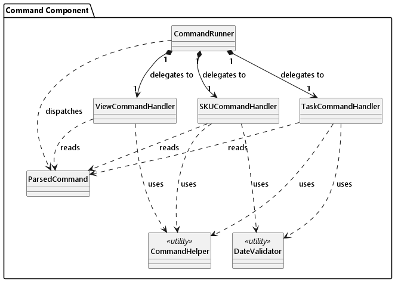

The `Command` component,

* acts as the central **Logic** layer of the application, bridging raw user input (provided as `ParsedCommand` objects from the **UI** component) and the underlying **Model** (`SKUList`, `SKU`, `SKUTask`).
* follows the **Single Responsibility Principle** by splitting all executable logic across three dedicated handler classes — `SKUCommandHandler`, `TaskCommandHandler`, and `ViewCommandHandler` — each owning a distinct command category.
* uses `CommandRunner` as the sole dispatch entry point, which receives every `ParsedCommand` and routes it to the correct handler via a `switch` statement. This means callers in the UI layer interact with exactly one class regardless of which command is being executed.
* relies on `CommandHelper` as a shared static utility class to avoid duplicating common parsing and lookup operations (e.g., finding a SKU by ID, parsing `Location`/`Priority` enums, parsing integer indices) across the three handler classes.
* uses `DateValidator` as a dedicated validation utility that enforces the `YYYY-MM-DD` format and calendar correctness on all user-supplied date strings, following the same validate-and-return-null pattern used by `CommandHelper`.
* uses `ParsedCommand` as an immutable, flag-keyed value object. All command words are normalized to lowercase and all flag keys are stored in a case-insensitive map, so handlers never need to perform their own normalization.
* depends on the **Model** component (`SKUList`, `SKU`, `SKUTaskList`, `SKUTask`) for all data mutations and reads. It depends on the **UI** component (`Ui`) only for output (success/error/info messages) and never performs any I/O of its own.
* triggers **Storage** operations exclusively through `CommandRunner`: state is loaded on construction and saved on `bye`/`exit`. The individual handlers are completely unaware of persistence.

---

#### `ParsedCommand`

`ParsedCommand` is an immutable value object produced by `Parser` and consumed by every handler. 
It exposes three query methods — `getCommandWord()`, `getArg(key)`, and `hasArg(key)` — and a 
`getAllFlags()` set used by `CommandHelper.validateFlags()` for strict flag validation across all handlers. Both the command 
word and all flag keys are normalized to lowercase at construction time, so handlers can safely 
use literal lowercase strings in comparisons.

---

#### `CommandRunner`

`CommandRunner` is instantiated once at application startup. Its constructor takes the shared `SKUList`, creates one instance each of the three handler classes, and immediately calls `Storage.loadState` to hydrate the model from disk. From that point forward, the main loop calls `run(ParsedCommand)` on every user input, and `CommandRunner` delegates to the appropriate handler or handles `bye`/`exit`/`export`/`help`/`viewmap` inline.

The sequence diagram below illustrates the dispatch lifecycle for a representative command:

**Command Dispatch Sequence for `CommandRunner`**

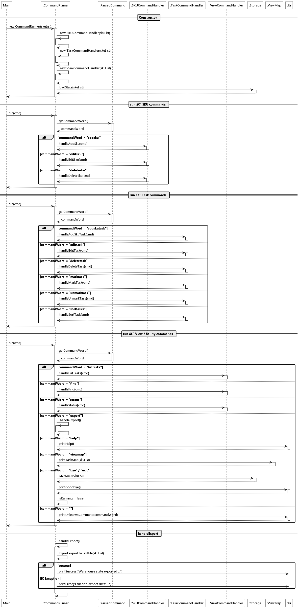

---

#### `SKUCommandHandler`

Handles the three SKU-level mutations: `addsku`, `editsku`, and `deletesku`. Each method validates that mandatory flags (`n/` and, where required, `l/`) are present before delegating to `CommandHelper` for enum parsing and SKU lookup. Duplicate-ID detection on `addsku` and not-found detection on `deletesku` are handled at this layer before any model mutation occurs.

The sequence diagram below illustrates the interactions for the `addsku` command:

**Interactions Inside the Command Component for the `addsku` Command**

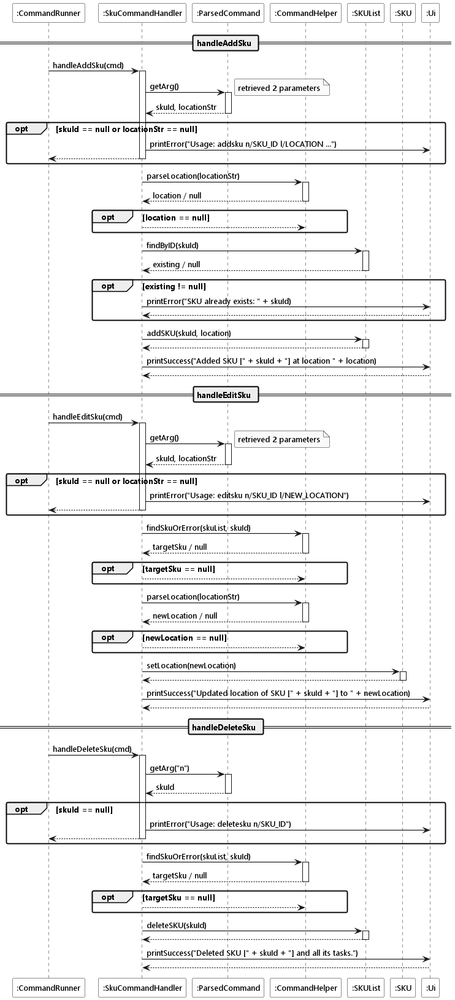

---

#### `TaskCommandHandler`

Handles the six task-level commands: `addskutask`, `edittask`, `deletetask`, `marktask`, `unmarktask`, and `sorttasks`. All date inputs pass through `DateValidator.validateDateOrError` before reaching the model. Index bounds are checked explicitly after parsing so that a precise `InvalidIndexException` (carrying both the bad index and the SKU ID) is thrown rather than a raw `IndexOutOfBoundsException` escaping to the top level.

The sequence diagrams below illustrate key interactions within `TaskCommandHandler`:

**Interactions Inside the Command Component for the `addskutask` Command**

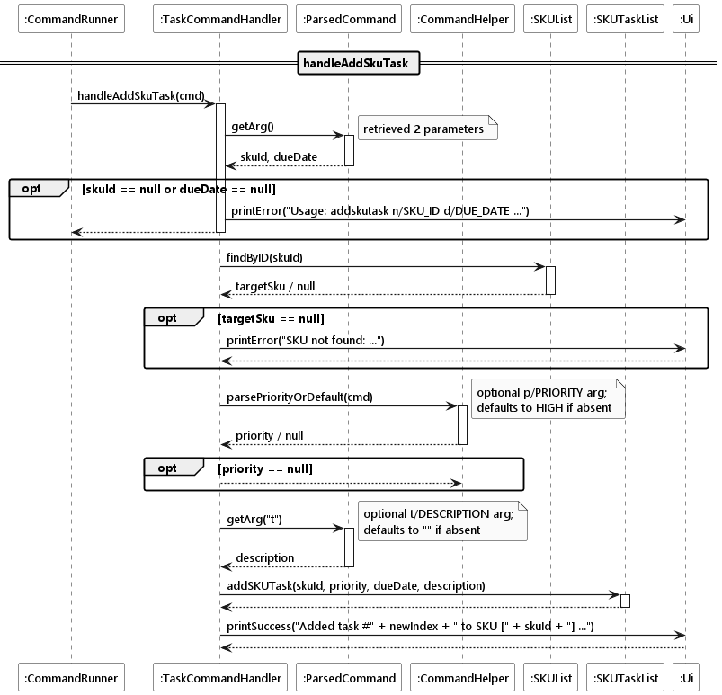

**Interactions Inside the Command Component for the `edittask` Command**

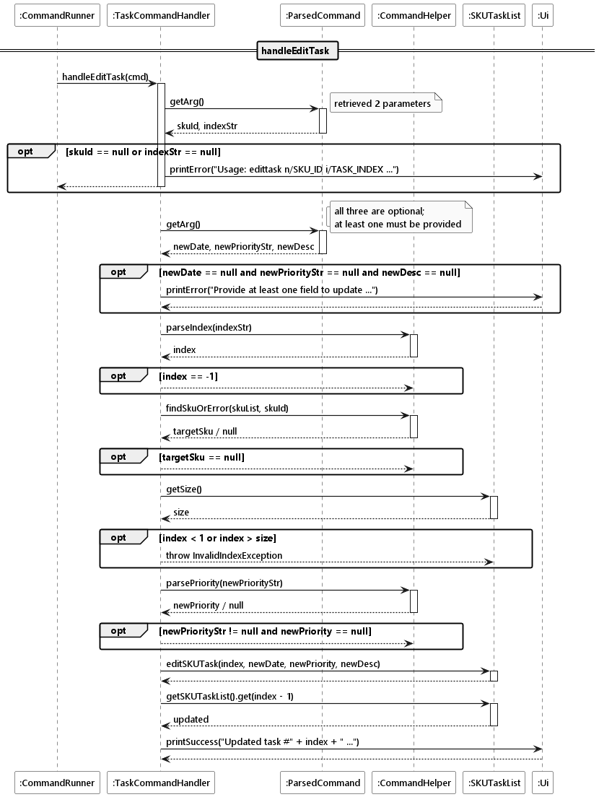

**Interactions Inside the Command Component for the `marktask` / `unmarktask` Commands**

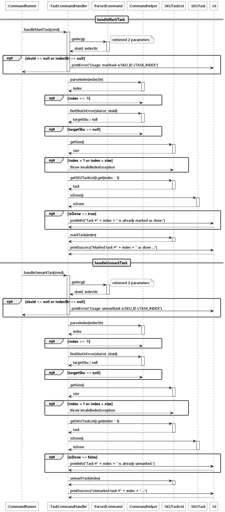

---

#### `ViewCommandHandler`

Handles the three read-only commands: `listtasks`, `find`, and `status`. Like all handlers, it validates flags via `CommandHelper.validateFlags()` (throwing `InvalidFilterException` for unrecognized flags). Additionally, it enforces `MultipleFilterException` if more than one filter is combined on `listtasks`. It then delegates to private sub-methods following the SLAP principle. The `find` command supports combinable filters (`n/`, `t/`, `i/`) and traverses the entire `SKUList`, accumulating formatted result strings before handing them to `Ui` for display in one call.

The sequence diagrams below illustrate key read paths in `ViewCommandHandler`:

**Interactions Inside the Command Component for the `listtasks` Command**

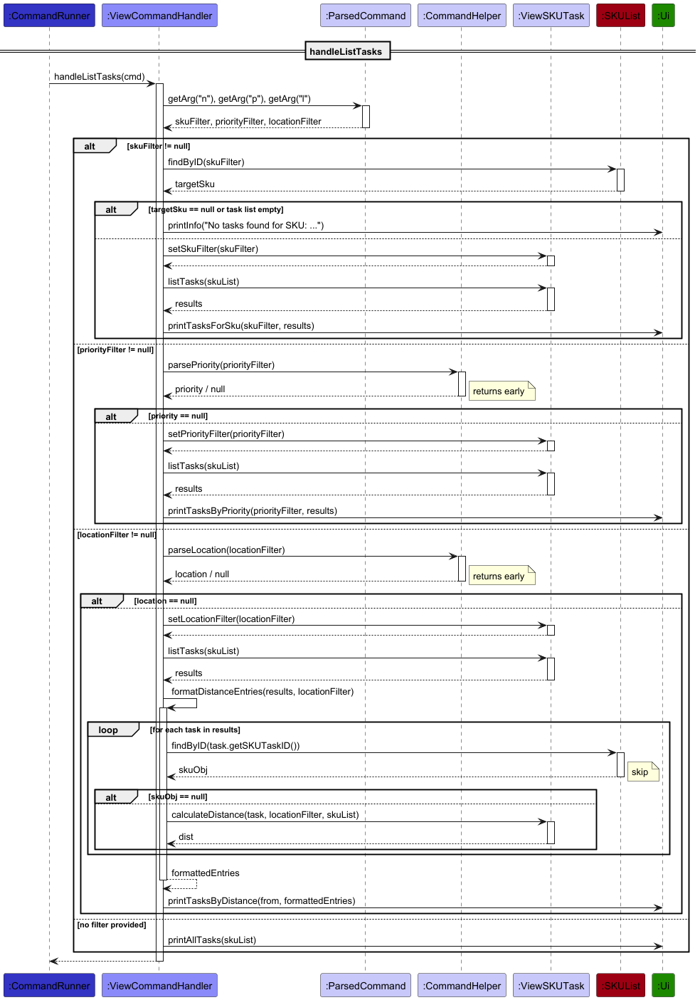

**Interactions Inside the Command Component for the `find` Command**

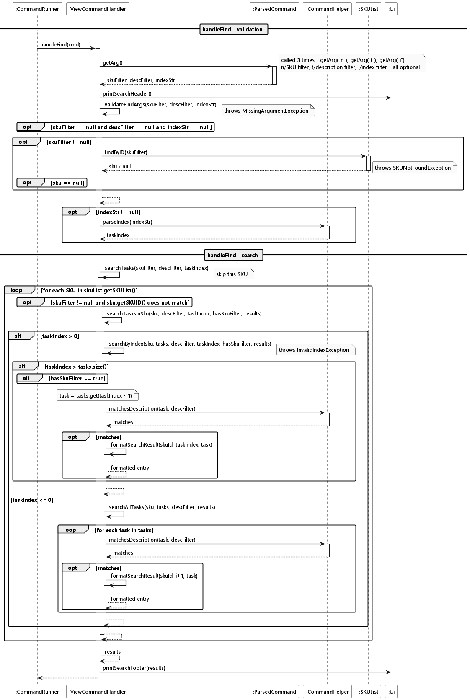

---

#### `CommandHelper` and `DateValidator`

These two classes are pure utilities with no state. `CommandHelper` centralises seven 
shared operations used across all three handler classes: flag validation (`validateFlags`),
SKU lookup with error printing 
(`findSkuOrError`), `Location` parsing (`parseLocation`), `Priority` parsing (`parsePriority
` and `parsePriorityOrDefault`), integer index parsing (`parseIndex`), and description-keyword
matching (`matchesDescription`). `DateValidator` isolates date validation behind a two-step check 
— regex format match first, then `LocalDate.parse` for calendar correctness — and logs 
both successful and rejected parses via `java.util.logging`.

---

The key design decisions for the `Command` component are summarised below:

* **Single entry point.** Routing all commands through `CommandRunner.run()` means the UI layer has no dependency on any individual handler, making it straightforward to add or rename commands in one place.
* **Null-on-failure convention.** `CommandHelper` and `DateValidator` both return `null` (and print an error via `Ui`) rather than throwing checked exceptions for recoverable input errors. Handlers check the return value and return early, keeping each method's happy path linear and readable.
* **Immutable `ParsedCommand`.** Handlers cannot accidentally mutate the parsed input, and the unmodifiable map prevents aliasing bugs across shared helper calls.
* **No persistence knowledge in handlers.** The three handler classes call only Model APIs. Storage interactions are confined to `CommandRunner`, so handlers remain independently testable without a file system.

### Exception component

**API** : `ItemTaskerException.java`, `EmptyListException.java`, `InvalidCommandException.java`, `InvalidFilterException.java`, `InvalidIndexException.java`, `MissingArgumentException.java`, `MultipleFilterException.java`, `SKUNotFoundException.java`

#### Architecture

The class diagram below illustrates the inheritance hierarchy of the Exception component:

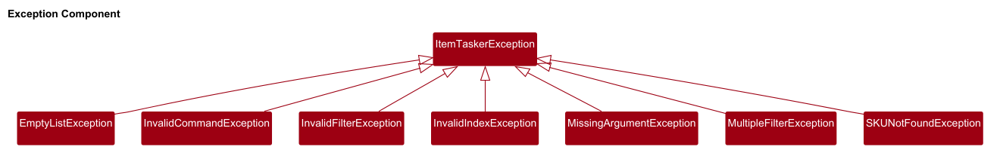

The `Exception` component,

* defines a single base class, `ItemTaskerException`, which extends Java's built-in `Exception`. All application-specific exceptions inherit from this class, establishing a unified exception hierarchy that callers can catch at either the specific or base level.
* is a **pure domain-error layer** with no dependencies on any other component. It does not reference the Model, Logic, UI, or Storage layers, ensuring it can be used freely across the entire codebase without introducing circular dependencies.
* provides **context-rich error messages** constructed at instantiation time. Each subclass formats its own message using the relevant domain data (e.g., the missing SKU ID, the out-of-range index, the conflicting filter), so callers never need to construct error strings themselves.
* uses **two constructors on the base class** — one accepting only a message, and one accepting a message and a cause — to support both standalone errors and exception wrapping where an underlying `Throwable` needs to be preserved for logging.

---

#### Exception Hierarchy

All seven concrete exceptions extend `ItemTaskerException` directly. There is intentionally no intermediate layer — each exception represents a distinct, named failure mode in the application:

* **`EmptyListException`** — thrown when an operation (e.g., listing or sorting) is attempted on a list that contains no items. Accepts a `listType` string to identify which list was empty.
* **`InvalidCommandException`** — thrown when the user enters an unrecognized, malformed, or syntactically incorrect command word.
* **`InvalidFilterException`** — thrown by all command handlers (via `CommandHelper.validateFlags()`) when an unrecognized flag is detected, or when a filter value is syntactically incorrect.
* **`InvalidIndexException`** — thrown when a task index is either out of bounds for its SKU's task list, cannot be parsed as a valid integer, or overflows integer limits. Provides three constructors to cover all these cases distinctly.
* **`MissingArgumentException`** — thrown when a required flag (e.g., `n/` or `d/`) is absent from a command. The message always includes the correct usage string for the offending command.
* **`MultipleFilterException`** — thrown by `ViewCommandHandler` when more than one filter flag (`n/`, `p/`, `l/`) is provided simultaneously on a `listtasks` command, which only supports a single filter at a time.
* **`SKUNotFoundException`** — thrown when a SKU ID provided by the user does not exist in the warehouse. The message includes the missing ID and directs the user to `listtasks`.

---

#### Design Notes

* **Checked exceptions.** All exceptions in this hierarchy are checked (they extend `Exception`, not `RuntimeException`). This forces callers in the Logic layer to explicitly declare or handle each failure mode, making the contract of each handler method visible at the API level.
* **Single-responsibility messages.** Because each subclass formats its own message, the handler classes stay clean — they throw with only the relevant domain value (e.g., `throw new SKUNotFoundException(skuId)`) rather than constructing message strings inline.
* **`InvalidIndexException` dual constructor.** The two constructors address two distinct failure points: an integer that parsed successfully but fell outside the valid range (`int` constructor), and a string that could not be parsed as an integer at all (`String` constructor). This keeps the type consistent while distinguishing the two error sources.

### SKU component

**API** : `SKUList.java`, `SKU.java`, `Location.java`.

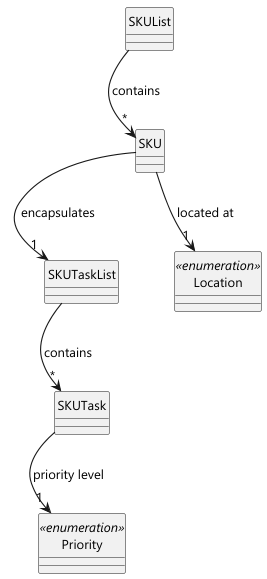

The `SKU` component,

* stores the data i.e., all `SKU` objects (which are contained in a central `SKUList` object).
* enforces data integrity at the domain level. The `SKUList` ensures that no duplicate SKU IDs exist within the warehouse, and the `SKU` constructor normalizes all IDs (trimming whitespace and converting to uppercase) while guaranteeing a mandatory valid `Location` is assigned.
* encapsulates task management by having each `SKU` object independently own and automatically initialize its own `SKUTaskList` upon creation. This establishes a strict object-oriented boundary where a SKU is solely responsible for its associated tasks.
* does not depend on any of the other main components (such as **`UI`**, **`Logic`**, or **`Storage`**). As the `SKU` component represents the core data entities of the domain, it makes sense on its own without depending on external execution or presentation layers.

### SKUTask component

**API** : `SKUTaskList.java`, `SKUTask.java`

Here's a class diagram of the SKUTask component:

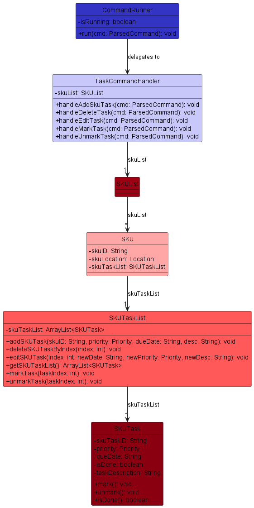

The sequence diagram below illustrates the interactions within the SKUTask component, taking the `addSKUTask` API call as an example.

**Interactions Inside the SKUTask Component for the `addskutask` Command**

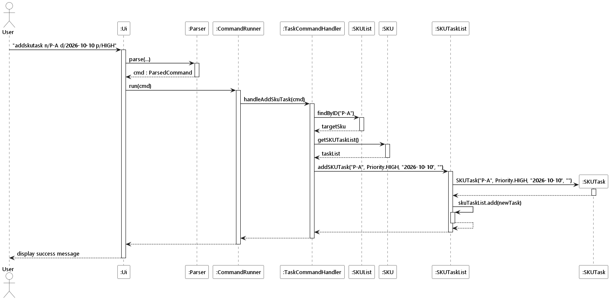

How the SKUTask component works:

When the `SKUTaskList` is called upon to execute a task-level operation, it receives the extracted task properties (e.g., date, priority, description) from the parent `SKU` that delegates it.
This results in a `SKUTask` object being instantiated (or an existing one being modified or deleted) which is managed entirely within the `SKUTaskList`.
The `SKUTaskList` communicates internally with the individual `SKUTask` items, enforcing controlled access through wrapper methods.
Note that although this is shown as a single step in the diagram above (for simplicity), in the code it can take several interactions (between the list and the individual task fields) to update specific parameters like the `Priority` enum or completion status.
The result of the task execution permanently mutates the system's memory model, which is ultimately fetched back by higher-level components for confirmation.

Here are the other interactions in the SKUTask component (omitted from the sequence diagram above) that are used for property reading and modifications:

**Property Modifications (Setters)**

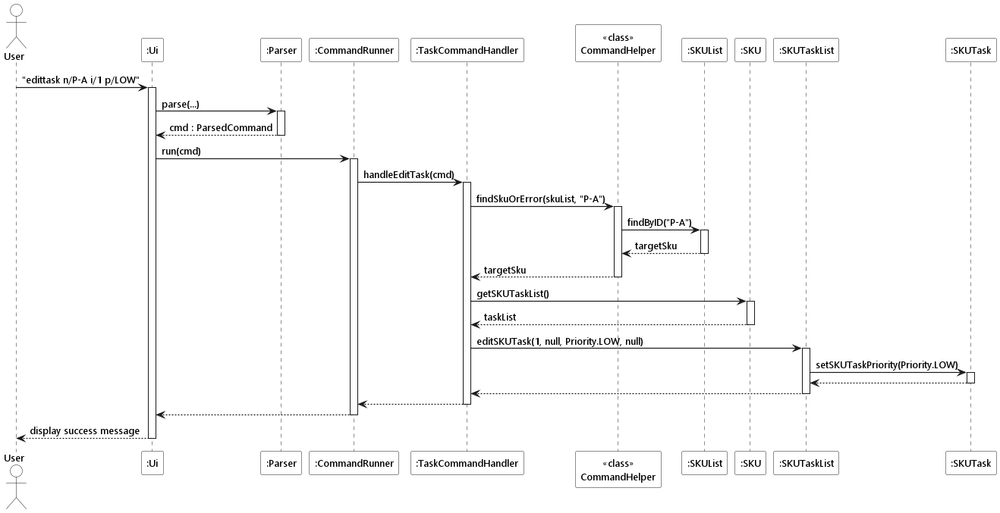

**Property Retrieval (Getters)**

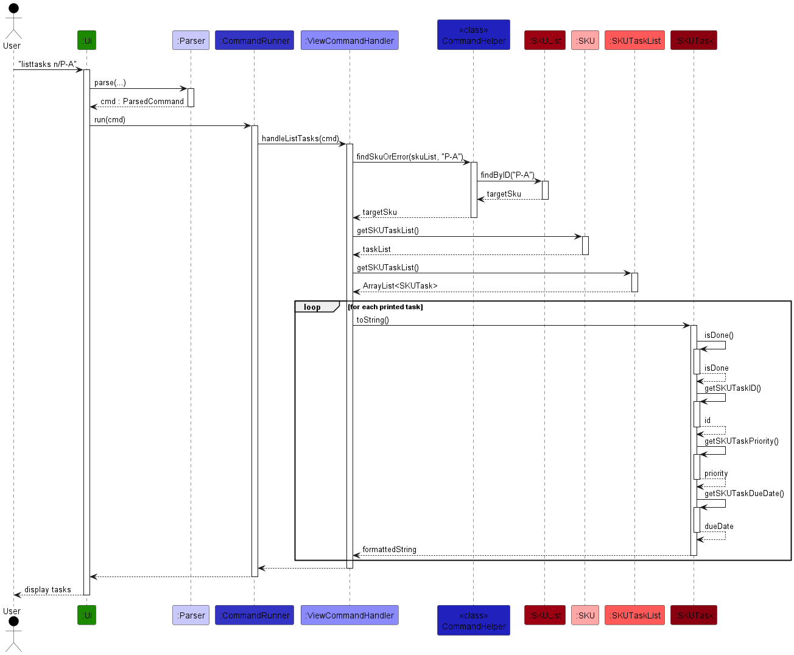

**Task Deletion**

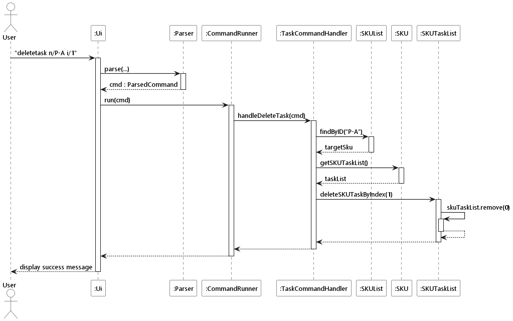

How task properties and deletions work:

When called upon to modify a task, the `TaskCommandHandler` class relies on a shared `CommandHelper` utility to safely locate the specific `SKUTask` object instance inside the model environment without needing to hold a map.
Depending on the command, it uses the specific parameter wrappers on the `SKUTaskList` object, which apply the mutation or extraction down to the base `SKUTask` class level and return the newly shaped data to the user.

### Storage component

**API** : `Storage.java` and `Export.java`.

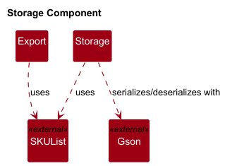

The `Storage` component,
* can save the warehouse inventory data (the entire `SKUList` hierarchy, including SKUs, SKUTaskLists, and SKUTasks) in JSON format to the hard disk, and read it back into the corresponding objects.
* can export the current warehouse state into a formatted, human-readable text file (`ItemTasker_Export.txt`) for reporting purposes.
* gracefully handles missing directories by automatically creating the required `Data/` folder upon saving or exporting.
* guards against corrupted or outdated data files during the loading sequence to prevent application crashes.
* depends on classes in the `sku` and `skutask` components (because the Storage component's job is to save, retrieve, and parse objects that represent the data of the App in memory).
* utilizes the external Gson library for all JSON serialization and deserialization processes.

### UI component

**API** : `Ui.java`, `Parser.java`, `ItemTasker.java`, `ItemTaskerLogger.java`, `ViewMap.java`

The UI component handles the lifecycle of user interaction, from capturing raw terminal input to displaying formatted warehouse data.

#### Architecture

The class diagram below illustrates the structure of the UI component and its relationship with the Logic and Model components:

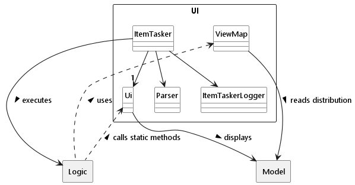

The UI consists of a core entry point, **ItemTasker**, which orchestrates the interaction between several specialized classes:
* **Ui**: Manages the `Scanner` for input and provides `static` methods for centralized terminal printing (e.g., success/error messages, headers).
* **Parser**: Responsible for decomposing raw strings into structured `ParsedCommand` objects using flag-based regex logic.
* **ViewMap**: A specialized display class that renders a 3x3 grid visualization of warehouse task distribution.
* **ItemTaskerLogger**: Manages internal system logging, redirecting debug output to `itemtasker.log` to keep the CLI interface clean.

How the UI component works:
* It **executes user commands** by passing `ParsedCommand` objects to the **Logic** component (`CommandRunner`).
* It **reads user input** via a blocking `while` loop in the `ItemTasker` main method.
* It **depends on Model classes** (e.g., `SKUList`, `SKUTask`) to extract and display data in formatted lists, maps, and status summaries.

#### Interactions

The sequence diagram below illustrates the standard interaction loop within the UI component when a user enters a command.

**Interactions within the UI Component for a Command Lifecycle**

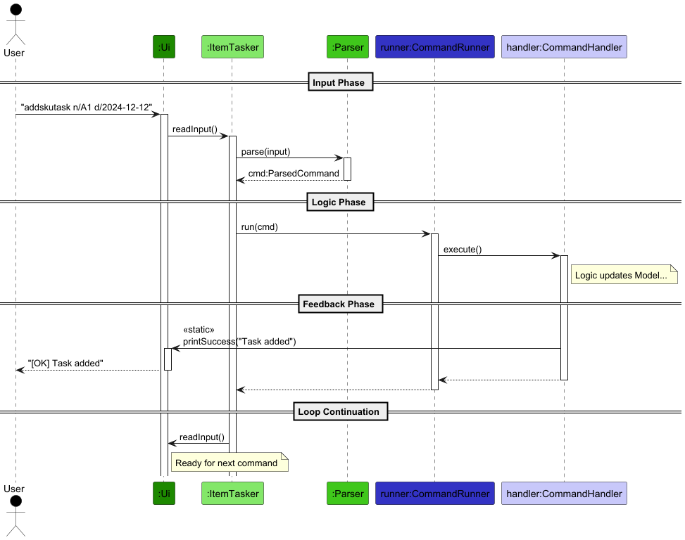

How the UI interaction loop works:
1.  **ItemTasker** calls `Ui#readInput()`, which prompts the user with `> ` and waits for a string.
2.  The raw string is passed to **Parser#parse()**, which identifies the command word and maps flags (e.g., `n/`, `d/`) to values.
3.  **ItemTasker** passes the resulting `ParsedCommand` to the **Logic** component (`CommandRunner`).
4.  If the logic execution fails, **ItemTasker** catches the exception and uses `Ui#printError()` to provide feedback.
5.  On successful execution, the **Logic** component calls back to **Ui** static methods to display the specific results.

#### Specialized Visualizations

Beyond standard text feedback, the UI component provides complex data rendering:

**Warehouse Map Rendering (`viewmap`)**
When `viewmap` is called, the **ViewMap** class iterates through the `SKUList`, maps task counts to a coordinate grid (A1-C3), and renders a 3x3 visual representation of the warehouse floor.

**Status Analysis Display**
The **Ui** component works with the Model's analysis tools to display completion percentages and pending task counts through `printSkuStatus` and `printWarehouseStatus`.

## Implementation

### Add / Delete SKU Feature

#### Implementation Details
The Add and Delete SKU mechanism is facilitated by the `SKUCommandHandler` component, which is dispatched by the `CommandRunner`. It manages the application's core state through a single primary data structure: the `SKUList`. Following object-oriented encapsulation principles, there are no external maps; each `SKU` manages its own `SKUTaskList`.

The operations are exposed and handled internally via the following methods:

* `SKUCommandHandler#handleAddSku(ParsedCommand)` — Validates arguments (ensuring they are not null or empty), checks for duplicates, and delegates to `SKUList` to instantiate a new `SKU` (which automatically initializes its own internal task list).
* `SKUCommandHandler#handleDeleteSku(ParsedCommand)` — Validates the input, ensures the target SKU exists, and removes the `SKU` from the inventory, which deletes purges all tasks associated with it.

Given below is an example usage scenario demonstrating how the Add SKU mechanism behaves at each step.

**Step 1.** The user executes `addsku n/PALLET-A l/A1`. The `Ui` reads the input, and the `Parser` extracts the command word and maps the arguments `n/` to `PALLET-A` and `l/` to `A1` into a `ParsedCommand` object.

**Step 2.** The `CommandRunner#run()` method receives this `ParsedCommand`. Recognizing the `addsku` command word, it routes execution to the dedicated `SKUCommandHandler#handleAddSku()`.

**Step 3.** `handleAddSku()` performs validations, checking for missing or empty arguments. It calls `CommandHelper.parseLocation("A1")` to resolve the `Location` enum. It then calls `skuList.findByID("PALLET-A")` to iterate through the `SKUList`. If no duplicates are found, it proceeds with the insertion.

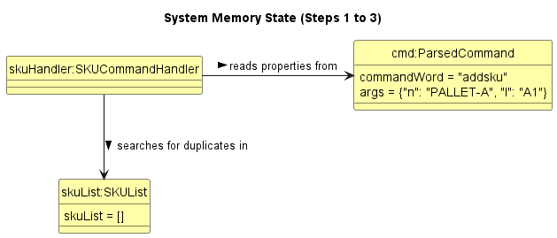

**Step 4.** The `SKUList#addSKU()` method is invoked. This method acts as a secondary defensive barrier, checking inputs before calling the `SKU` constructor. During instantiation, the `SKU` normalizes its ID (trimming whitespace and forcing uppercase) and automatically generates an empty `SKUTaskList` for itself. The `SKU` is then appended to the internal `ArrayList`.

**Step 5.** Back in `handleAddSku()`, execution completes successfully. Control returns to the `Ui` to print the success message. The system's memory state now contains the new `SKU`, fully equipped to accept tasks without requiring any external mapping.

*Note: The `deletesku` command operates by routing to `SKUCommandHandler#handleDeleteSku()`, which validates the input and throws a `SKUNotFoundException` if the target does not exist. It then calls `SKUList#deleteSKU()` to perform a case-insensitive removal from the array. Due to encapsulation, dropping the `SKU` object automatically garbage-collects its associated `SKUTaskList`, preventing memory leaks.*

The following sequence diagram shows the flow of adding a SKU:

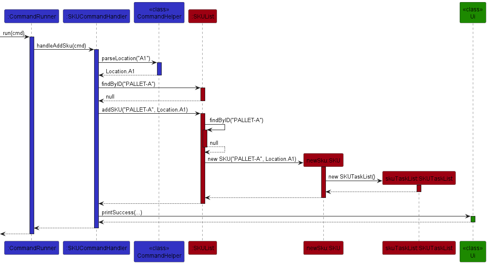

The following class diagram shows the architecture:

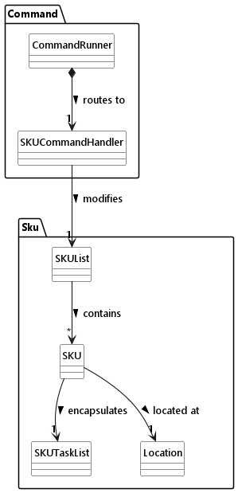

#### Design Considerations

**Aspect: How SKU tasks are stored and mapped to their parent SKU:**

* **Current Implementation:** Require all task operations to access the `SKUTaskList` directly through the `SKU` object residing in the `SKUList`.
  * *Pros:* High cohesion and strict encapsulation. A SKU is solely responsible for its own tasks. Memory overhead is reduced, and state mutations are safer as there is no need to synchronize deletions across multiple data structures.
  * *Cons:* Slightly slower lookup times, as finding a task requires iterating through the `SKUList` to locate the parent SKU first (O(n) complexity).
* **Alternative:** Maintain a `HashMap<String, SKUTaskList>` inside the command handlers or `CommandRunner` to map SKU IDs to their tasks.
  * *Pros:* Fast, O(1) time complexity when looking up tasks for a specific SKU during filtering or task addition.
  * *Cons:* Severe data duplication and poor encapsulation. This requires the handlers to juggle references and manually synchronize deletions across two separate data structures, leading to an architecture prone to orphaned tasks if not correctly synced.

### Add / Delete SKU Task Feature

#### Implementation Details

The Add and Delete SKU Task operations are facilitated by the `CommandRunner` component, which routes execution to the specific SKU identified by the user, and subsequently down to that SKU's `SKUTaskList`. The `SKUTaskList` internally manages an `ArrayList<SKUTask>` and delegates data updates to the underlying `SKUTask` instances. The properties for a task include its ID, due date, completion status, and importantly, its `Priority` (an enum of HIGH, MEDIUM, or LOW). The `SKUTaskList` provides internal wrapper methods for additions, deletions, and modifications to enforce safe encapsulation.

The operations are handled internally via the following flow:

* `TaskCommandHandler#handleAddSkuTask(ParsedCommand)` — Extracts the targeted SKU ID and the task properties (including `Priority`). It looks up the SKU via `SKUList#findByID()` and delegates to `SKUTaskList#addSKUTask()` to instantiate a new `SKUTask`.
* `TaskCommandHandler#handleDeleteTask(ParsedCommand)` — Calls `CommandHelper#findSkuOrError()` to locate the SKU safely, validates the target task index, and instructs `SKUTaskList#deleteSKUTaskByIndex()` to remove the task from the internal array.

Given below is an example usage scenario demonstrating how the Add SKU Task mechanism behaves step-by-step.

**Step 1.** The user executes `addskutask n/P-A d/2026-10-10 p/HIGH`. The `Ui` reads the input, and the `Parser` extracts the command word and maps the arguments `n/` to `P-A`, `d/` to `2026-10-10`, and `p/` to `HIGH` into a `ParsedCommand` object.

**Step 2.** The `CommandRunner#run()` method receives this `ParsedCommand`. Recognizing the `addskutask` command word, it routes execution to `TaskCommandHandler#handleAddSkuTask()`.

**Step 3.** `handleAddSkuTask()` processes the properties (parsing `HIGH` into the `Priority` enum). It calls `skuList.findByID("P-A")` to locate the target `SKU`. Upon finding it, it retrieves the SKU's internal `SKUTaskList`.

**Step 4.** The `SKUTaskList#addSKUTask()` method is invoked. This method instantiates a new `SKUTask` object with the extracted properties (including the `Priority` enum state). The task is appended to the internal `ArrayList`.

**Step 5.** Execution completes successfully, and control returns to the `Ui` to print the success message.

*Note: The delete operation follows a nearly identical traversal, except `TaskCommandHandler#handleDeleteTask()` parses the target index instead of properties, and delegates to `SKUTaskList#deleteSKUTaskByIndex()`.*

The following sequence diagram shows the end-to-end flow of adding a SKU Task:

The following sequence diagram shows the end-to-end flow of deleting a SKU Task:

### Task Property Access (Setters & Getters)

#### Implementation Details

Updating or retrieving a task's state passes entirely from a specific command handler down to `SKUTaskList`, and finally to individual `SKUTask` objects. When a user executes `edittask n/P-A i/1 p/LOW`, the flow routes to `TaskCommandHandler#handleEditTask()`, which locates the SKU and invokes `SKUTaskList#editSKUTask()`. `SKUTaskList` identifies the proper `SKUTask` at the index and modifies its state exclusively, reinforcing the abstraction.

The following sequence diagram shows the holistic flow of setting properties (e.g., due date, priority, and description via `t/DESC`):

The following sequence diagram illustrates reading properties from the objects for listing (e.g., executing `listtasks n/P-A`). Note that task output is produced by `toString()`, which internally includes the description if non-empty:

The following class diagram shows the architecture connecting the `CommandRunner` down to the `SKUTask` instances:

#### Design Considerations

**Aspect: Managing task modifications via `SKUTaskList` wrappers versus returning internal objects:**

* **Current Implementation:** `SKUTaskList` handles modification duties in place (e.g., reading indices inside `editSKUTask` and mapping updates, working directly with enums like `Priority`).
    * *Pros:* Strong encapsulation. `SKUTaskList` dictates precisely how a task is safely modified, without leaking mutable object references back to caller-components.
    * *Cons:* Requires additional boilerplate wrapper methods inside `SKUTaskList` just to pass down simple enum updates (`Priority`) or strings to the internal tasks.
* **Alternative:** Expose `getTask(index)` method from `SKUTaskList`, letting callers (e.g., `CommandRunner`) modify the returned `SKUTask` object directly.
    * *Pros:* Simpler logic to write, heavily reducing the number of pass-through methods in `SKUTaskList`.
    * *Cons:* Weakens data coupling boundaries. A caller command might hold onto a `SKUTask` and accidentally modify it asynchronously outside of the defined safe access points, compromising system stability.

### Edit SKU / Edit Task Feature

#### Implementation Details

The Edit SKU and Edit Task operations allow users to modify existing data in the warehouse. Edit SKU updates a SKU's warehouse location, while Edit Task updates a task's due date, priority, and/or description. Both operations are facilitated by the `CommandRunner` component, which routes execution to the appropriate handler and down to the target object.

The operations are handled internally via the following methods:

* `SKUCommandHandler#handleEditSku(ParsedCommand)` — Locates the target SKU, validates the new location, and delegates to `SKU#setLocation()`.
* `TaskCommandHandler#handleEditTask(ParsedCommand)` — Locates the target SKU and task, validates all provided fields (date, priority, description), and delegates to `SKUTaskList#editSKUTask()`.

#### Edit SKU

Given below is an example usage scenario for the Edit SKU mechanism.

**Step 1.** The user executes `editsku n/PALLET-A l/C3`. The `Ui` reads the input, and the `Parser` maps the arguments into a `ParsedCommand` object.

**Step 2.** The `CommandRunner#run()` method routes execution to `SKUCommandHandler#handleEditSku()`.

**Step 3.** `handleEditSku()` calls `CommandHelper.findSkuOrError()` to locate the target `SKU` via case-insensitive lookup. If not found, an error is printed and the method returns early.

**Step 4.** The handler calls `CommandHelper.parseLocation("C3")` to validate and convert the string into a `Location` enum. If the location is invalid (e.g. `Z9`), an error is printed and the method returns.

**Step 5.** `SKU#setLocation(Location.C3)` is called, updating the SKU's location in place. All existing tasks attached to the SKU are preserved. A success message is displayed.

The following sequence diagram shows the flow of editing a SKU:

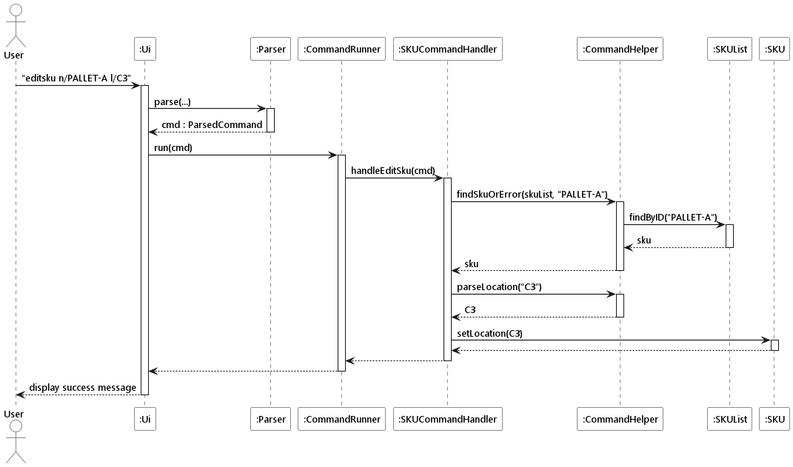

The following class diagram shows the architecture:

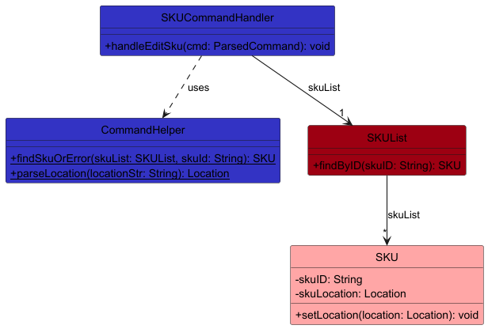

#### Edit Task

Given below is an example usage scenario for the Edit Task mechanism.

**Step 1.** The user executes `edittask n/PALLET-A i/1 d/2026-12-31 p/LOW t/updated`. The `Ui` reads the input, and the `Parser` maps the arguments into a `ParsedCommand` object.

**Step 2.** The `CommandRunner#run()` method routes execution to `TaskCommandHandler#handleEditTask()`.

**Step 3.** `handleEditTask()` performs a multi-stage validation chain:
1. Checks required arguments (`n/` SKU ID, `i/` task index) are present
2. Checks at least one editable field (`d/`, `p/`, `t/`) is provided
3. Validates date format via `DateValidator.validateDateOrError()`
4. Parses and validates index via `CommandHelper.parseIndex()`
5. Locates SKU via `CommandHelper.findSkuOrError()`
6. Bounds-checks the index against the task list size
7. Parses and validates priority via `CommandHelper.parsePriority()`

**Step 4.** Only after all validations pass, the handler calls `SKUTaskList#editSKUTask()`. This method applies only the non-null fields — unchanged fields are preserved. Internally, it delegates to `SKUTask#setSKUTaskDueDate()`, `SKUTask#setSKUTaskPriority()`, and `SKUTask#setSKUTaskDescription()` as needed.

**Step 5.** Execution completes and a success message is displayed showing the updated task state.

The following sequence diagram shows the flow of editing a task:

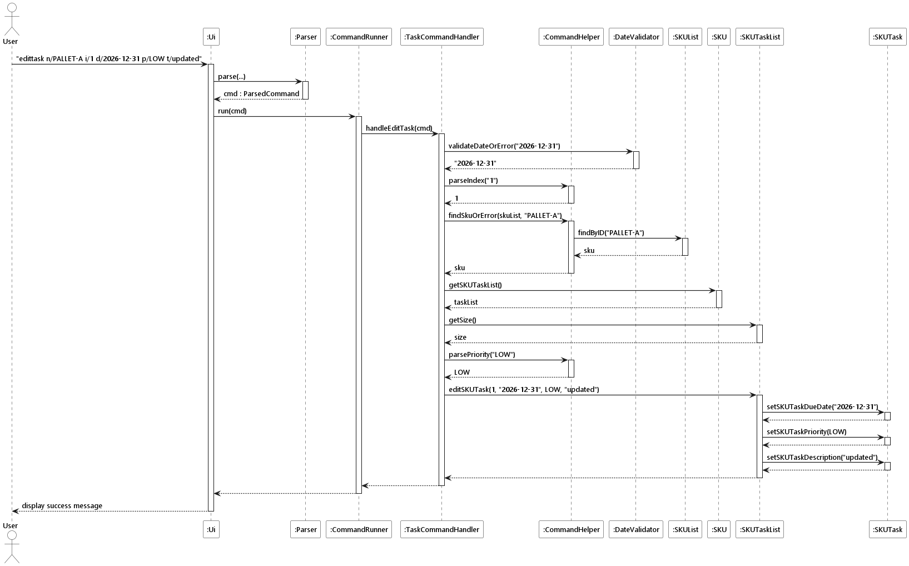

The following class diagram shows the architecture:

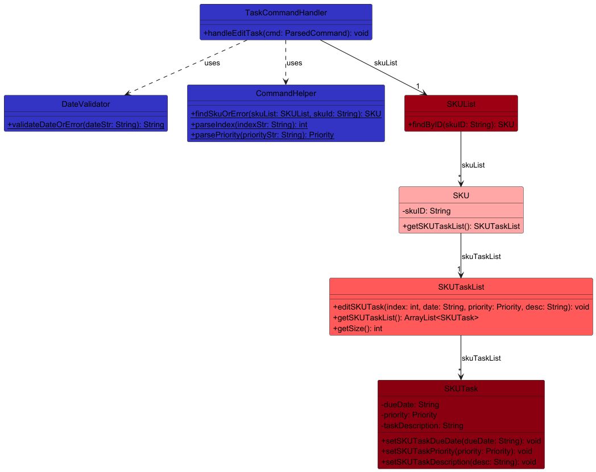

#### Design Considerations

**Aspect: In-place mutation vs. delete-and-recreate for Edit SKU:**

* **Current Implementation:** Directly mutates the `SKU` object's location field via `setLocation()`.
    * *Pros:* Simple, efficient, and preserves all existing tasks attached to the SKU. No risk of orphaned tasks.
    * *Cons:* The SKU object is mutable, which could be a concern in concurrent environments.
* **Alternative:** Delete the old SKU and recreate it at the new location, then re-attach tasks.
    * *Pros:* Maintains immutability of SKU objects.
    * *Cons:* Significantly more complex. Requires migrating all tasks to the new object, with high risk of data loss if the migration fails partway.

**Aspect: Managing task modifications via `SKUTaskList` wrappers versus returning internal objects:**

* **Current Implementation:** `SKUTaskList#editSKUTask()` handles modification duties in place, applying only non-null fields to the target `SKUTask`.
    * *Pros:* Strong encapsulation. `SKUTaskList` dictates precisely how a task is safely modified, without leaking mutable object references back to caller-components.
    * *Cons:* Requires additional boilerplate wrapper methods inside `SKUTaskList` just to pass down simple updates to the internal tasks.
* **Alternative:** Expose `getTask(index)` method from `SKUTaskList`, letting callers modify the returned `SKUTask` object directly.
    * *Pros:* Simpler logic to write, reducing the number of pass-through methods.
    * *Cons:* Weakens data coupling boundaries. A caller might hold onto a `SKUTask` and accidentally modify it outside of the defined safe access points.

### View SKU Task Feature

#### Implementation Details

The View SKU Task mechanism allows users to retrieve filtered or sorted views of the warehouse tasks without modifying the underlying data. This is facilitated by the **ViewSKUTask** logic processor, which decouples the filtering and sorting algorithms from the core **CommandRunner** and **Model** components.

The feature supports three primary modes:
1.  **SKU Filtering (`n/`):** Isolates tasks belonging to a specific SKU ID.
2.  **Priority Filtering (`p/`):** Streams all tasks and filters by the **Priority** enum (**HIGH**, **MEDIUM**, **LOW**).
3.  **Spatial Sorting (`l/`):** Sorts all system tasks based on the distance from a specified warehouse **Location**.

The operations are handled internally via the following flow:

* **Command Parsing:** **ItemTasker** reads the raw input via **Ui** and passes it to the **Parser**, which returns a **ParsedCommand**.
* **Command Routing:** **ItemTasker** passes this command to **CommandRunner**, which delegates the request to **ViewCommandHandler#handleListTasks(cmd)**.
* **Logic Instantiation:** The handler instantiates a short-lived **ViewSKUTask** object and sets the respective filter strings.
* **Data Aggregation (The Gathering Loop):** Before filtering, **ViewSKUTask#listTasks(skuList)** must perform a full traversal of the **SKUList**. It visits every **parentSku** to collect all **SKUTask** objects into a "flattened" master list.
* **Filtering & Sorting Logic:**
  * For **SKU ID** and **Priority**, the viewer applies a Java Stream filter directly on the aggregated task list. Since these properties are encapsulated within the **SKUTask** object, no further model interaction is required after the initial gather.
  * For **Distance**, the viewer uses `calculateDistance()` within a comparator. This method performs a secondary **parent-lookup** for each task to retrieve physical coordinates from its associated **SKU**.

The Distance formula used for spatial sorting is:
$$\text{Distance} = |x_1 - x_2| + |y_1 - y_2|$$

---

#### Usage Scenarios and Sequence Diagrams

**Scenario 1: Spatial Sorting (`listtasks l/B2`)**
This scenario demonstrates the dual-loop process. The first loop gathers tasks from the hierarchy. The second loop occurs in the **ViewCommandHandler**, which calls `calculateDistance` for each result to format the distance values for the UI display.

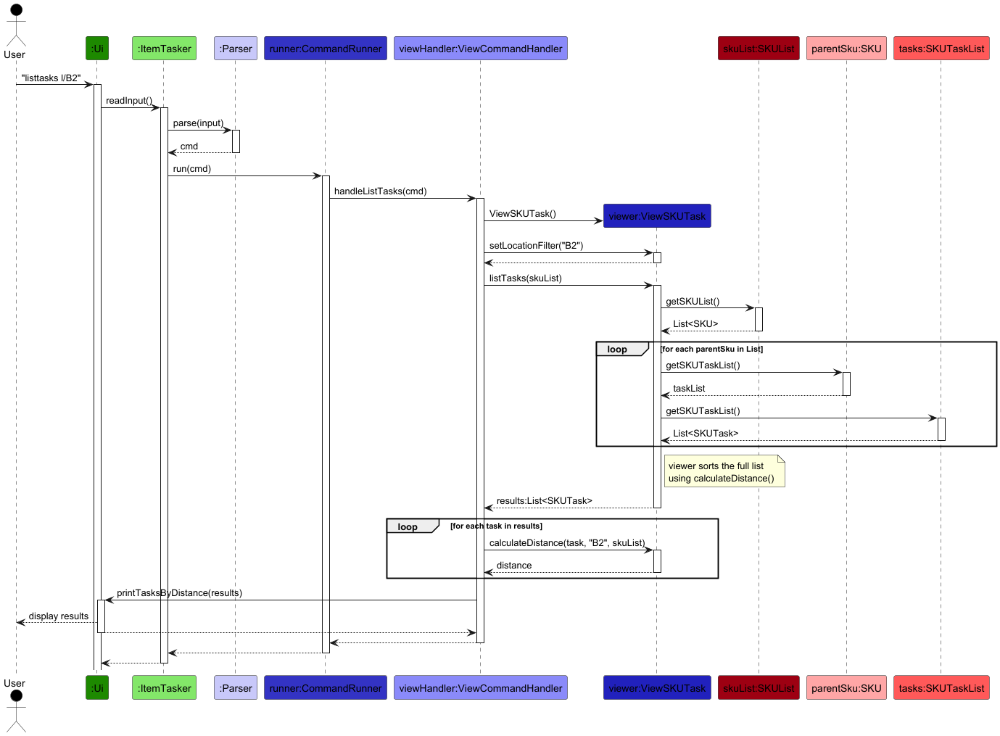

**Scenario 2: Priority Filtering (`listtasks p/HIGH`)**
In this flow, only the initial Gathering loop is required to populate the task list. The filtering happens internally within the viewer.

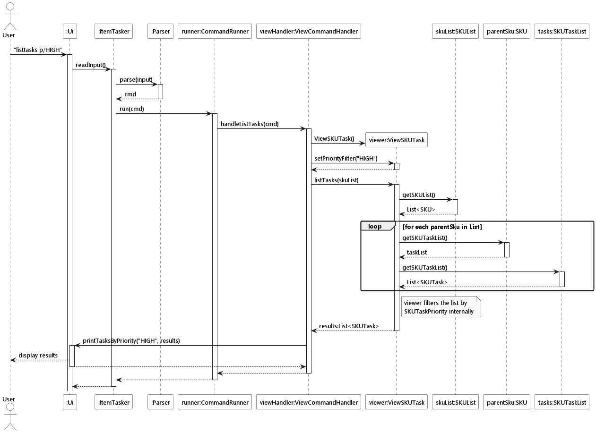

**Scenario 3: SKU ID Filtering (`listtasks n/A123`)**
Similar to priority filtering, the viewer gathers all tasks via the hierarchy loop and then applies an internal string-match filter for the SKU ID.

---

#### Architecture

The following class diagram shows how the logic components are structured to support the command flow from **ItemTasker** down to the **ViewSKUTask** processor:

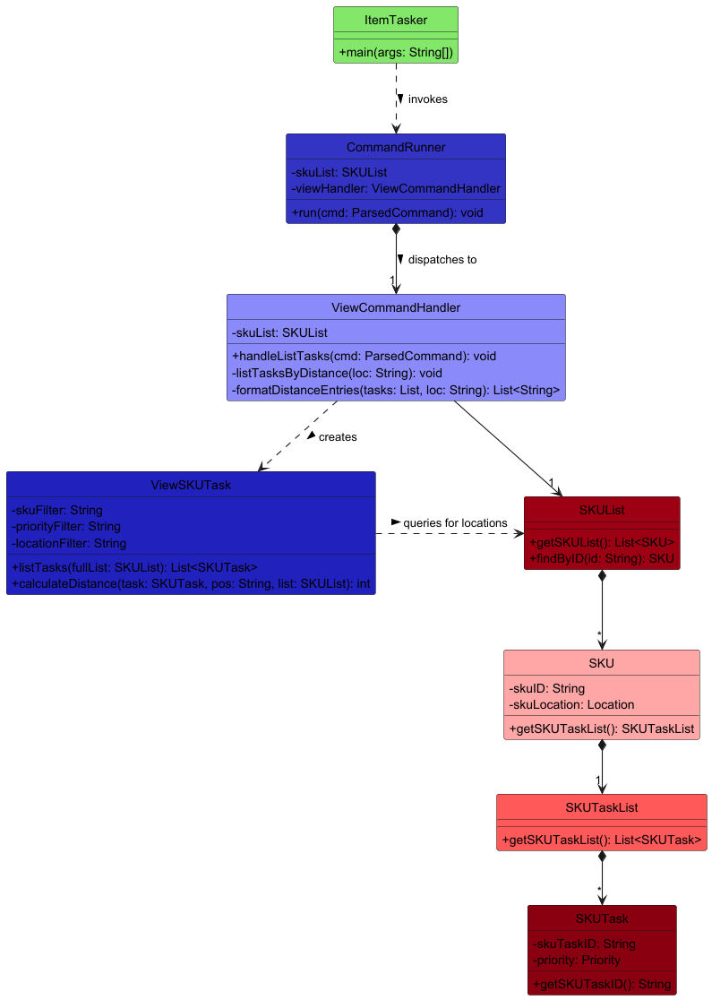

---

#### Design Considerations

**Aspect: Data "Flattening" for Global Views**

* **Current Implementation:** **ViewSKUTask** manually iterates through the nested **SKU -> SKUTaskList** hierarchy to build a temporary list for filtering/sorting.
  * **Pros:** Maintains strict encapsulation. Neither **CommandRunner** nor **ViewSKUTask** needs to maintain a redundant global map of tasks, ensuring the **SKU** remains the single source of truth for its tasks.
  * **Cons:** Performance cost of $O(N)$ where $N$ is the total number of SKUs, as every list must be visited to gather tasks for a global view.
* **Alternative:** Maintain a `MasterTaskList` in **SKUList** that updates whenever a task is added/deleted.
  * **Pros:** Sorting and filtering are faster ($O(1)$ to retrieve the base list).
  * **Cons:** Higher risk of data inconsistency. Deleting an SKU would require purging its specific tasks from the master list, increasing complexity in the `Delete SKU` feature.

## Appendix A: Product Scope

### Target user profile
This product is targeted at Inventory Managers of Warehouse Distribution Centers who prefer a CLI UI for fast access and easy tracking.

### Value proposition
Enterprise systems are often slow and rigid. ItemTracker provides an agile, local layer for managing immediate warehouse tasks. Managers can log and view "action items" on specific stock items without the latency of connecting the servers of enterprise systems. It ensures that critical tasks, (e.g product inspections) are tracked accordingly.

## Appendix B: User Stories

| Version | As a ...          | I want to ...                                                                    | So that I can ...                                                                                |
|---------|-------------------|----------------------------------------------------------------------------------|--------------------------------------------------------------------------------------------------|
| v1.0    | Inventory Manager | register a new SKU                                                               | begin tracking accountability tasks for this particular SKU                                      |
| v1.0    | Inventory Manager | add a task to a specific SKU                                                     | ensure necessary inspections are conducted                                                       |
| v1.0    | Inventory Manager | assign a priority level to each task                                             | clear tasks that need to be performed first                                                      |
| v1.0    | Inventory Manager | mark a task as completed for a specific SKU                                      | track the tasks completed in a given day                                                         |
| v1.0    | Inventory Manager | set due dates for tasks assigned to a SKU                                        | quickly locate specific tasks without browsing through the entire list                           |
| v1.0    | Inventory Manager | input my current location and sort tasks in terms of distance to me              | clear tasks in the warehouse starting with the closest task (in terms of distance) to me         |
| v1.0    | Inventory Manager | delete a task for a specific SKU                                                 | not unnecessarily track it if it needs to be dropped                                             |
| v1.0    | Inventory Manager | view all my tasks in a single dashboard ordered by SKU                           | know what needs to be completed & plan accordingly                                               |
| v1.0    | Inventory Manager | set a default priority for all new tasks                                         | speed up the task creation process                                                               |
| v1.0    | Inventory Manager | attach a "Location" to a task                                                    | not waste time looking for the item that needs work                                              |
| v2.0    | Inventory Manager | sort my tasks by priority                                                        | complete only high-priority tasks in the event of limited time                                   |
| v2.0    | Inventory Manager | pull up the tasks only for a specific SKU                                        | complete all the tasks for a given SKU if required                                               |
| v2.0    | Inventory Manager | search for tasks using keywords                                                  | quickly locate specific tasks without browsing through the entire list                           |
| v2.0    | Inventory Manager | view a help guide of available commands                                          | learn how to use the CLI without external documentation                                          |
| v2.0    | Inventory Manager | generate a view of the amount of tasks in each sector of the warehouse           | have a birds-eye view of the location of each task                                               |
| v2.0    | Inventory Manager | add notes or comments to individual task                                         | document observations or special conditions during task execution                                |
| v2.0    | Inventory Manager | register a new SKU identifier into a localDB                                     | track specific tasks for an item separately                                                      |
| v2.0    | Inventory Manager | attach an action item to a registered SKU                                        | the condition + quality of the item is monitored                                                 |
| v2.0    | Inventory Manager | assign priority level when creating a task                                       | ensure urgent issues such as expiring goods are attended to in time                              |
| v2.0    | Inventory Manager | execute a command to view a dashboard summary of all active SKUs & pending tasks | instantly get a view of all SKUs without using a complicated GUI                                 |
| v2.0    | Inventory Manager | mark a task as resolved                                                          | clear the queue of outstanding tasks by priority                                                 |
| v2.0    | Inventory Manager | export a list of all high priority tasks to a readable format, e.g CSV           | print a physical checklist for warehouse associates who do not have access to the CLI            |
| v2.0    | Inventory Manager | search for a specific SKU id                                                     | quickly audit all pending actions for a specific product that might be under inspection / recall |
| v2.0    | Inventory Manager | edit the description of an existing task                                         | update information efficiently                                                                   |
| v2.0    | Inventory Manager | conduct an analysis on a SKU                                                     | for reporting and analytics to colleagues                                                        |

## Appendix C: Non-Functional Requirements

1. **Environment Requirements:** The system should work on any mainstream OS (Windows, Linux, macOS) as long as it has Java `17` or above installed.
2. **Data Requirements:** Data should be stored locally in a single `Data/storage.json` file without requiring a standalone database management system. The size of the text file should be kept minimal.
3. **Performance Requirements:** The system should execute all commands (e.g. adding, deleting, listing) and display the output within two seconds on a standard modern PC.
4. **Usability (Quality) Requirements:** A user with above-average typing speed for regular English text (i.e., not code, not system admin commands) should be able to accomplish most of the tasks faster using CLI than using a GUI-based application.
5. **Quality (Robustness) Requirements:** The application should be able to handle invalid user input gracefully without crashing.
6. **Process Requirements:** The project should follow the milestones set for CS2113 and utilize GitHub Actions for Continuous Integration (CI) and automated testing.
7. **Maintainability Requirements:** Code should be structured in a modular fashion using Object-Oriented principles to ensure extensibility for future features. Strict Checkstyle rule configurations must be adhered to.

## Appendix D: Glossary

* *AB3* - AddressBook-Level3, a sample application created by the SE-EDU initiative, used as a foundational architecture for this project.
* *CI* - Continuous Integration, the practice of automating the integration of code changes into a shared repository, often using tools like GitHub Actions.
* *CLI* - Command-Line Interface, a text-based interface used to interact with software by typing commands.
* *CSV* - Comma-Separated Values, a plain text file format used to store tabular data.
* *GUI* - Graphical User Interface, a visual way of interacting with a computer using items such as windows, icons, and menus.
* *I/O* - Input/Output, referring to the communication between the application and the local file system (e.g., reading/writing files).
* *JSON* - JavaScript Object Notation, a lightweight, text-based, human-readable data interchange format used by the Storage component to save the warehouse state.
* *OS* - Operating System, the system software that manages computer hardware and software resources (e.g., Windows, Linux, macOS).
* *Regex* - Regular Expression, a sequence of characters that specifies a search pattern, used in this project for strict input and date validation.
* *SKU* - Stock Keeping Unit, a unique identifier used to track specific inventory items or pallets within the warehouse.
* *SLAP* - Single Level of Abstraction Principle, a software engineering principle stating that all statements within a method should operate at the same level of abstraction.
* *SRP* - Single Responsibility Principle, a software design principle stating that a class or module should have one, and only one, reason to change (e.g., a handler managing only one type of command).
* *UI* - User Interface, the space where interactions between humans and the application occur.
* *UML* - Unified Modeling Language, a general-purpose modeling language used to visualize the design and architecture of the system.

## Appendix E: Instructions for Manual Testing

Given below are instructions to test the app manually.

### Launch and shutdown

#### Initial launch
1. Download the latest `.jar` file and copy it into an empty folder.
2. Open a terminal in that folder and run `java -jar ItemTasker.jar`.
3. *Expected:* The welcome logo appears. A new `Data/` folder is generated in the background.

#### Shutdown
1. Type `bye`.
2. *Expected:* The goodbye message is printed, the application closes, and a storage file is populated in the `Data/` folder.

### Adding and Deleting SKUs and Tasks

#### Adding tasks with missing/invalid data
1. *Prerequisite:* Add a valid SKU using `addsku n/PALLET-1 l/A1`.
2. *Test case:* `addskutask n/PALLET-1 d/2026-02-30 t/Check items` (Impossible calendar date).
3. *Expected:* Task is rejected. Error message informs user the date does not exist.
4. *Test case:* `addskutask n/GHOST-SKU d/2026-10-10` (Non-existent SKU).
5. *Expected:* Task is rejected. Error message states SKU not found.

#### Deleting out-of-bounds tasks
1. *Prerequisite:* Ensure `PALLET-1` has exactly 1 task.
2. *Test case:* `deletetask n/PALLET-1 i/2`
3. *Expected:* Task deletion fails. Error message states index 2 is out of range.
4. *Test case:* `deletetask n/PALLET-1 i/-1`
5. *Expected:* Task deletion fails. Error message explicitly states task index must be a positive integer.

### Storage and File Integrity

#### Dealing with a corrupted JSON file
1. *Prerequisite:* Run the app, add a SKU, type `bye` to save.
2. Open `Data/storage.json` in a text editor and randomly delete some quotation marks or brackets to break the JSON syntax. Save the file.
3. Launch ItemTasker again.
4. *Expected:* The application does not crash. It logs a severe error to the console warning the user about the corrupted JSON and loads an empty warehouse state.

#### Dealing with an obstructed directory
1. *Prerequisite:* Ensure the application is closed. Delete the `Data` folder if it exists.
2. Create a standard text file and name it exactly `Data` (with no file extension).
3. Launch ItemTasker and type the `export` command.
4. *Expected:* The application attempts to create the `Data/` directory for the export file, realizes a file is blocking it, and safely prints: `[ERROR] Failed to export data: Target path 'Data' exists but is not a directory.` without crashing.