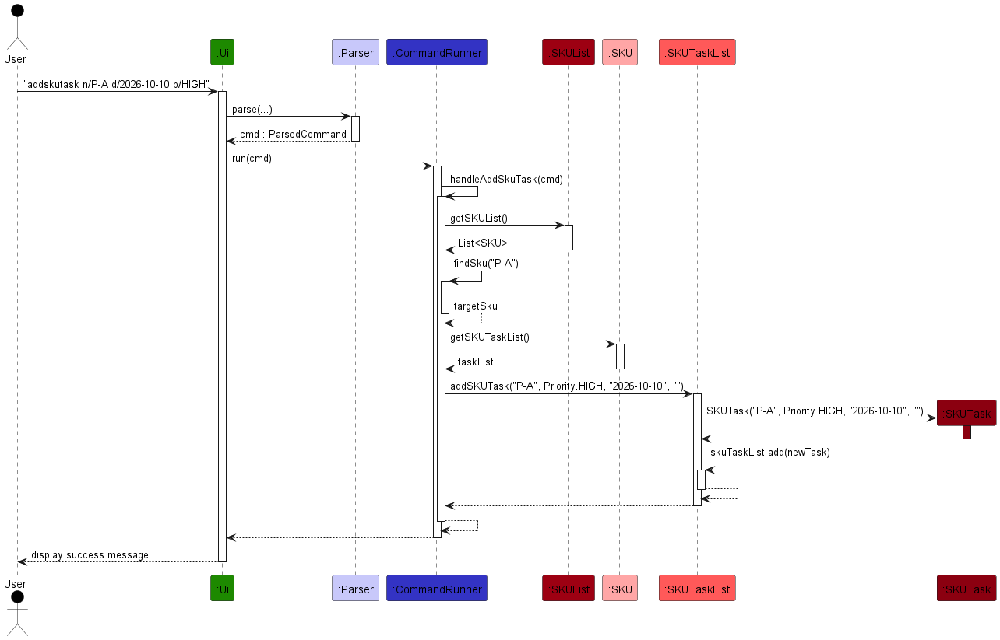
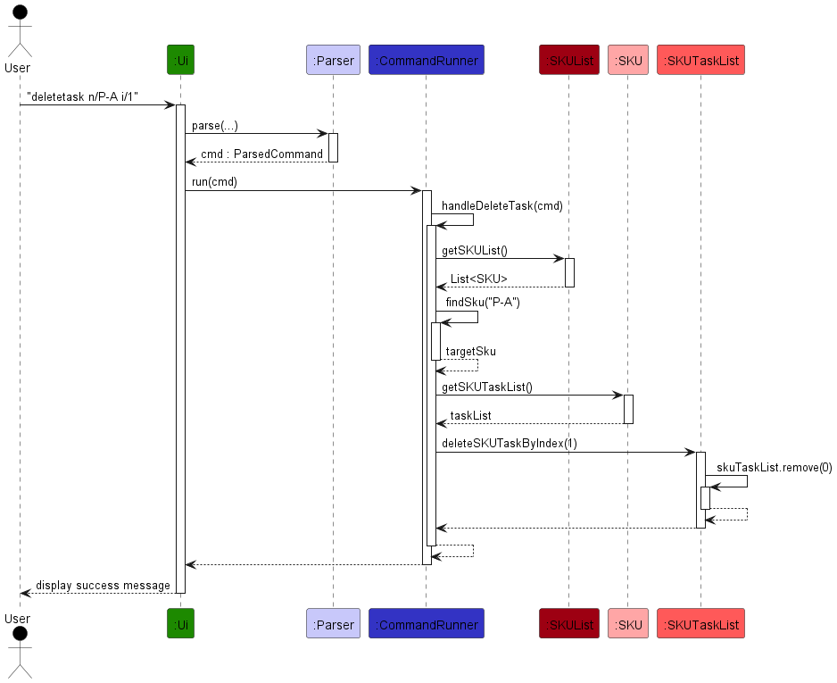
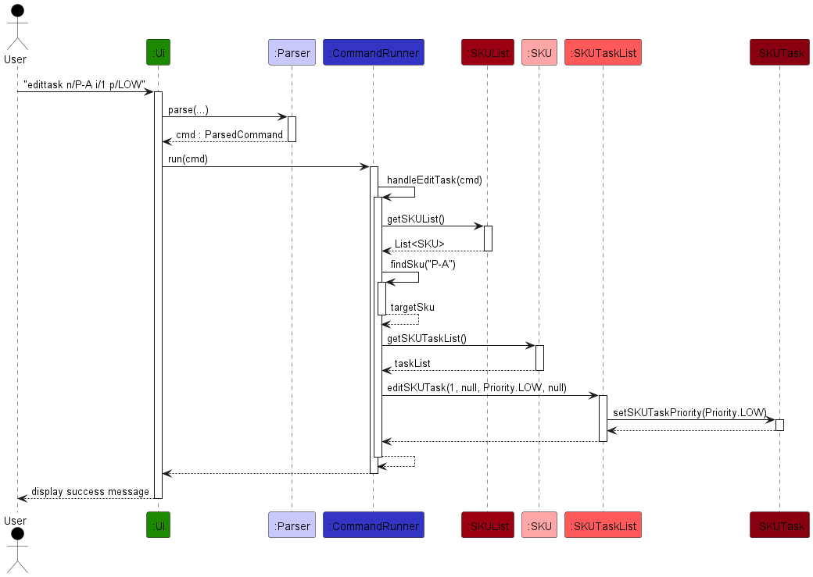
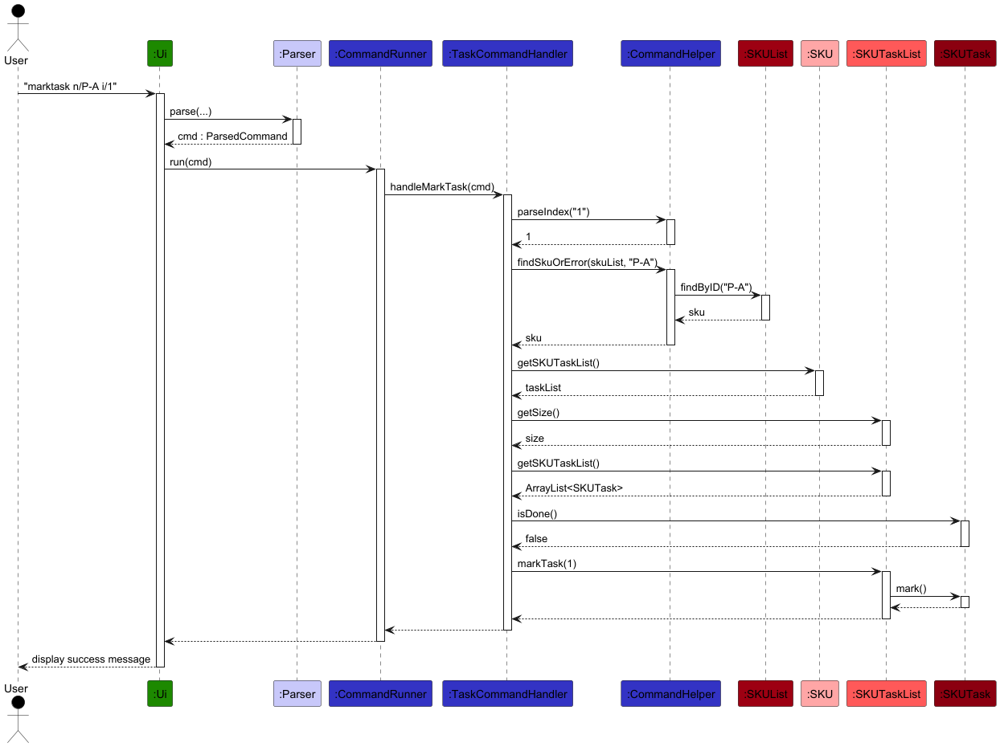
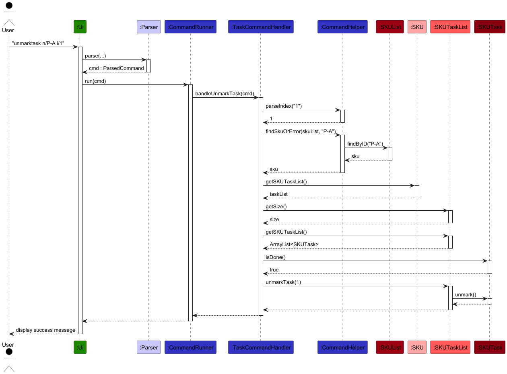
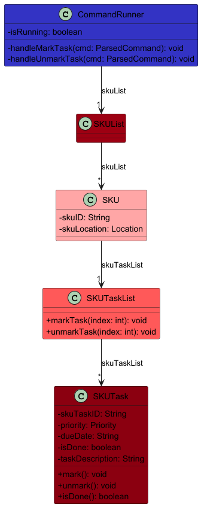
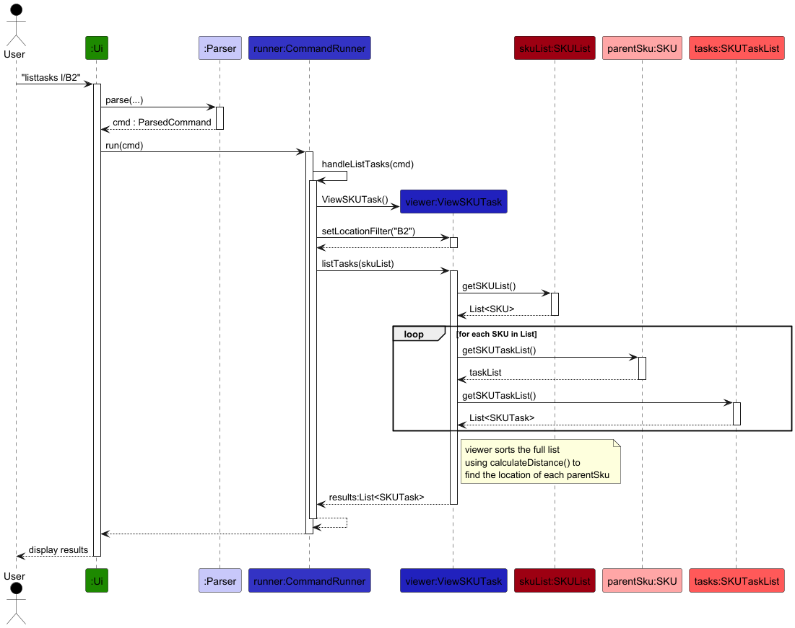
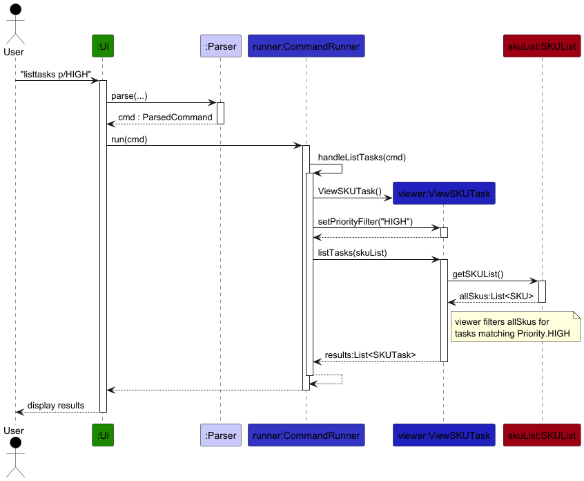
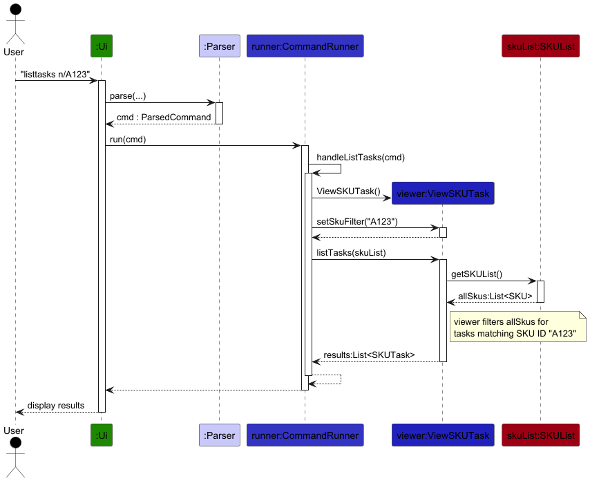

# Developer Guide

## Acknowledgements

{list here sources of all reused/adapted ideas, code, documentation, and third-party libraries -- include links to the original source as well}

## Design

## Implementation

### Add / Delete SKU Feature

#### Implementation Details

The Add and Delete SKU mechanism is facilitated by the `CommandRunner` component, which manages the application's core state through a single primary data structure: the `SKUList`. Following strict Object-Oriented encapsulation, there are no external maps; each `SKU` inherently manages its own `SKUTaskList`.

The operations are exposed and handled internally via the following methods:

* `CommandRunner#handleAddSku(ParsedCommand)` — Validates constraints and delegates to `SKUList` to instantiate a new `SKU` (which automatically initializes its own internal task list).
* `CommandRunner#handleDeleteSku(ParsedCommand)` — Removes the `SKU` from the inventory, which inherently purges all tasks associated with it.

Given below is an example usage scenario demonstrating how the Add SKU mechanism behaves at each step.

**Step 1.** The user executes `addsku n/PALLET-A l/A1`. The `Ui` reads the input, and the `Parser` extracts the command word and maps the arguments `n/` to `PALLET-A` and `l/` to `A1` into a `ParsedCommand` object.

**Step 2.** The `CommandRunner#run()` method receives this `ParsedCommand`. Recognizing the `addsku` command word, it routes execution to `CommandRunner#handleAddSku()`.

**Step 3.** `handleAddSku()` parses the location string into a `Location` enum. It then calls `findSku("PALLET-A")` to iterate through the `SKUList`. Finding no duplicates, it proceeds with the insertion.

**Step 4.** The `SKUList#addSKU()` method is invoked. This method calls the `SKU` constructor, instantiating a new `SKU` object. During instantiation, the `SKU` automatically generates an empty `SKUTaskList` for itself. The `SKU` is then appended to the internal `ArrayList`.

**Step 5.** Back in `handleAddSku()`, execution completes successfully. Control returns to the `Ui` to print the success message. The system's memory state now contains the new `SKU`, fully equipped to accept tasks without requiring any external mapping.

*Note: The `deletesku` command operates by simply calling `SKUList#deleteSKU()` to remove the object from the array. Due to encapsulation, dropping the `SKU` object automatically garbage-collects its associated `SKUTaskList`, preventing memory leaks.*

The following sequence diagram shows the flow of adding a SKU:

The following class diagram shows the architecture:

#### Design Considerations

**Aspect: How SKU tasks are stored and mapped to their parent SKU:**

* **Current Implementation:** Require all task operations to access the `SKUTaskList` directly through the `SKU` object residing in the `SKUList`.
    * *Pros:* High cohesion and strict encapsulation. A SKU is solely responsible for its own tasks. Memory overhead is reduced, and state mutations are safer as there is no need to synchronize deletions across multiple data structures.
    * *Cons:* Slightly slower lookup times, as finding a task requires iterating through the `SKUList` to locate the parent SKU first (O(n) complexity).
* **Alternative:** Maintain a `HashMap<String, SKUTaskList>` inside the `CommandRunner` to map SKU IDs to their tasks.
    * *Pros:* Fast, O(1) time complexity when looking up tasks for a specific SKU during filtering or task addition.
    * *Cons:* Severe data duplication and poor encapsulation. This requires the `CommandRunner` to juggle references and manually synchronize deletions across two separate data structures, leading to an architecture prone to orphaned tasks if not correctly synced.

### Add / Delete SKU Task Feature

#### Implementation Details

The Add and Delete SKU Task operations are facilitated by the `CommandRunner` component, which routes execution to the specific SKU identified by the user, and subsequently down to that SKU's `SKUTaskList`. The `SKUTaskList` internally manages an `ArrayList<SKUTask>` and delegates data updates to the underlying `SKUTask` instances. The properties for a task include its ID, due date, completion status, and importantly, its `Priority` (an enum of HIGH, MEDIUM, or LOW). The `SKUTaskList` provides internal wrapper methods for additions, deletions, and modifications to enforce safe encapsulation.

The operations are handled internally via the following flow:

* `CommandRunner#handleAddSkuTask(ParsedCommand)` — Extracts the targeted SKU ID and the task properties (including `Priority`). It calls `CommandRunner#findSku()` to validate the SKU's existence and delegates to `SKUTaskList#addSKUTask()` to instantiate a new `SKUTask`.
* `CommandRunner#handleDeleteTask(ParsedCommand)` — Calls `CommandRunner#findSku()` to locate the SKU, validates the target task index, and instructs `SKUTaskList#deleteSKUTaskByIndex()` to remove the task from the internal array.

Given below is an example usage scenario demonstrating how the Add SKU Task mechanism behaves step-by-step.

**Step 1.** The user executes `addskutask n/P-A d/2026-10-10 p/HIGH`. The `Ui` reads the input, and the `Parser` extracts the command word and maps the arguments `n/` to `P-A`, `d/` to `2026-10-10`, and `p/` to `HIGH` into a `ParsedCommand` object.

**Step 2.** The `CommandRunner#run()` method receives this `ParsedCommand`. Recognizing the `addskutask` command word, it routes execution to `CommandRunner#handleAddSkuTask()`.

**Step 3.** `handleAddSkuTask()` processes the properties (parsing `HIGH` into the `Priority` enum). It calls `findSku("P-A")` to locate the target `SKU`. Upon finding it, it retrieves the SKU's internal `SKUTaskList`.

**Step 4.** The `SKUTaskList#addSKUTask()` method is invoked. This method instantiates a new `SKUTask` object with the extracted properties (including the `Priority` enum state). The task is appended to the internal `ArrayList`.

**Step 5.** Execution completes successfully, and control returns to the `Ui` to print the success message.

*Note: The delete operation follows a nearly identical traversal, except `CommandRunner#handleDeleteTask()` parses the target index instead of properties, and delegates to `SKUTaskList#deleteSKUTaskByIndex()`.*

The following sequence diagram shows the end-to-end flow of adding a SKU Task:

The following sequence diagram shows the end-to-end flow of deleting a SKU Task:

### Task Property Access (Setters & Getters)

#### Implementation Details

Updating or retrieving a task's state passes entirely through `CommandRunner`, down to `SKUTaskList`, and finally to individual `SKUTask` objects. When a user executes `edittask n/P-A i/1 p/LOW`, `CommandRunner#handleEditTask()` locates the SKU and invokes `SKUTaskList#editSKUTask()`. `SKUTaskList` identifies the proper `SKUTask` at the index and modifies its state exclusively, reinforcing the abstraction.

The following sequence diagram shows the holistic flow of setting properties (e.g., due date, priority, and description via `t/DESC`):

The following sequence diagram illustrates reading properties from the objects for listing (e.g., executing `listtasks n/P-A`). Note that task output is produced by `toString()`, which internally includes the description if non-empty:

The following class diagram shows the architecture connecting the `CommandRunner` down to the `SKUTask` instances:

#### Design Considerations

**Aspect: Managing task modifications via `SKUTaskList` wrappers versus returning internal objects:**

* **Current Implementation:** `SKUTaskList` handles modification duties in place (e.g., reading indices inside `editSKUTask` and mapping updates, working directly with enums like `Priority`).
    * *Pros:* Strong encapsulation. `SKUTaskList` dictates precisely how a task is safely modified, without leaking mutable object references back to caller-components.
    * *Cons:* Requires additional boilerplate wrapper methods inside `SKUTaskList` just to pass down simple enum updates (`Priority`) or strings to the internal tasks.
* **Alternative:** Expose `getTask(index)` method from `SKUTaskList`, letting callers (e.g., `CommandRunner`) modify the returned `SKUTask` object directly.
    * *Pros:* Simpler logic to write, heavily reducing the number of pass-through methods in `SKUTaskList`.
    * *Cons:* Weakens data coupling boundaries. A caller command might hold onto a `SKUTask` and accidentally modify it asynchronously outside of the defined safe access points, compromising system stability.

### Mark / Unmark SKU Task Feature

#### Implementation Details

The Mark and Unmark operations allow users to toggle the completion state of a `SKUTask`. Both operations are facilitated by the `CommandRunner` component, which routes execution through the SKU's `SKUTaskList` down to the individual `SKUTask`.

The operations are handled internally via the following methods:

* `CommandRunner#handleMarkTask(ParsedCommand)` — Locates the target SKU and task, validates that the task is not already marked, and delegates to `SKUTaskList#markTask()`.
* `CommandRunner#handleUnmarkTask(ParsedCommand)` — Locates the target SKU and task, validates that the task is not already unmarked, and delegates to `SKUTaskList#unmarkTask()`.

Given below is an example usage scenario for the Mark SKU Task mechanism.

**Step 1.** The user executes `marktask n/P-A i/1`. The `Ui` reads the input, and the `Parser` maps the arguments into a `ParsedCommand` object.

**Step 2.** The `CommandRunner#run()` method routes execution to `CommandRunner#handleMarkTask()`.

**Step 3.** `handleMarkTask()` calls `findSku("P-A")` to locate the target `SKU`. It then retrieves the `SKUTaskList` and the internal `ArrayList<SKUTask>` to validate the index.

**Step 4.** The task's `isDone()` state is checked. If already marked, an info message is returned. Otherwise, `SKUTaskList#markTask(1)` is called, which delegates to `SKUTask#mark()` to set `isDone = true`.

**Step 5.** Execution completes and a success message is displayed.

*Note: `unmarktask` follows the same traversal in reverse — it validates the task is currently marked before calling `SKUTaskList#unmarkTask()`, which delegates to `SKUTask#unmark()`.*

The following sequence diagram shows the flow of marking a task:

The following sequence diagram shows the flow of unmarking a task:

The following class diagram shows the architecture:

#### Design Considerations

**Aspect: Pre-condition check before toggling state:**

* **Current Implementation:** `handleMarkTask()` and `handleUnmarkTask()` check `isDone()` on the task before delegating, rejecting redundant operations with an info message.
    * *Pros:* Prevents silent no-ops that could confuse users (e.g., marking an already-done task with no feedback).
    * *Cons:* Requires an extra read call to `isDone()` before the write, slightly increasing coupling between `CommandRunner` and `SKUTask` state.
* **Alternative:** Delegate the guard check into `SKUTaskList` or `SKUTask` itself, throwing an exception on invalid toggle.
    * *Pros:* Encapsulates the guard closer to the data.
    * *Cons:* Requires exception propagation for a non-exceptional condition, which adds overhead and complicates the call chain.

### View SKU Task Feature

#### Implementation Details

The View SKU Task mechanism allows users to retrieve filtered or sorted views of the warehouse tasks without modifying the underlying data. This is facilitated by the `ViewSKUTask` logic processor, which decouples the filtering and sorting algorithms from the core `CommandRunner` and `Model` components.

The feature supports three primary modes:
1.  **SKU Filtering (`n/`):** Isolates tasks belonging to a specific SKU ID.
2.  **Priority Filtering (`p/`):** Streams all tasks and filters by the `Priority` enum (HIGH, MEDIUM, LOW).
3.  **Spatial Sorting (`l/`):** Sorts all system tasks based on the distance from a specified warehouse `Location`.

The operations are handled internally via the following flow:

* **Command Routing:** `CommandRunner#handleListTasks(ParsedCommand)` extracts the arguments, instantiates a `ViewSKUTask` object, and sets the respective filter strings.
* **Data Aggregation:** `ViewSKUTask#listTasks(SKUList)` performs a full traversal of the `SKUList` to gather all available `SKUTask` objects into a "flattened" master list.
* **Filtering & Sorting Logic:**
  * For **SKU ID** and **Priority**, the viewer applies a Java Stream filter directly on the task list. Since these properties are encapsulated within the `SKUTask` object itself, no further interaction with the Model is required.
  * For **Distance**, the viewer uses `calculateDistance()` within a comparator. This method performs a **parent-lookup** for each task to retrieve the physical coordinates from its associated `parentSku`.

The Distance formula used for spatial sorting is:
$$\text{Distance} = |x_1 - x_2| + |y_1 - y_2|$$

#### Usage Scenarios and Sequence Diagrams

**Scenario 1: Spatial Sorting (`listtasks l/B2`)** This scenario demonstrates the parent-lookup loop required to resolve coordinates. The viewer iterates through each `SKU` to collect tasks and then references the `parentSku` location during the sort.

**Scenario 2: Priority Filtering (`listtasks p/HIGH`)** This illustrates a simplified flow. Because `Priority` is stored internally within the `SKUTask`, the viewer gathers the tasks once and filters them internally without further Model interaction.

**Scenario 3: SKU ID Filtering (`listtasks n/A123`)** Similar to Priority filtering, the SKU ID is an internal property of the `SKUTask`. The viewer gathers the list and filters it without needing a secondary lookup to the `parentSku`.

#### Architecture

The following class diagram shows how the `ViewSKUTask` logic component interacts with the Model:

#### Design Considerations

**Aspect: Data "Flattening" for Global Views:**

* **Current Implementation:** `ViewSKUTask` manually iterates through the nested `SKU -> SKUTaskList` hierarchy to build a temporary list for filtering/sorting.
  * *Pros:* Maintains strict encapsulation. Neither `CommandRunner` nor `ViewSKUTask` needs to maintain a redundant global map of tasks, ensuring the `SKU` remains the single source of truth for its tasks.
  * *Cons:* Performance cost of $O(N)$ where $N$ is the total number of SKUs, as every list must be visited to gather tasks for a global view.
* **Alternative:** Maintain a `MasterTaskList` in `SKUList` that updates whenever a task is added/deleted.
  * *Pros:* Sorting and filtering are faster ($O(1)$ to retrieve the base list).
  * *Cons:* Higher risk of data inconsistency. Deleting an SKU would require purging its specific tasks from the master list, increasing complexity in the `Delete SKU` feature.

## Appendix A: Product Scope

### Target user profile

{Describe the target user profile}

### Value proposition

{Describe the value proposition: what problem does it solve?}

## Appendix B: User Stories

| Version | As a ... | I want to ...             | So that I can ...                                           |
|---------|----------|---------------------------|-------------------------------------------------------------|
| v1.0    | new user | see usage instructions    | refer to them when I forget how to use the application      |
| v2.0    | user     | find a to-do item by name | locate a to-do without having to go through the entire list |

## Appendix C: Non-Functional Requirements

{Give non-functional requirements}

## Appendix D: Glossary

* *glossary item* - Definition

## Appendix E: Instructions for Manual Testing

{Give instructions on how to do a manual product testing e.g., how to load sample data to be used for testing}